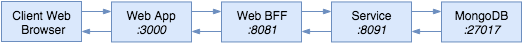
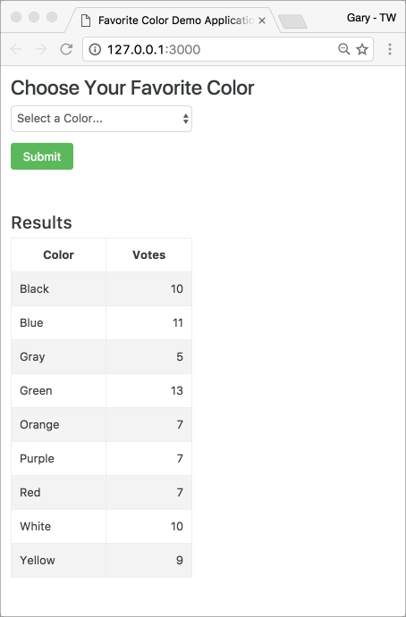

[](https://travis-ci.org/garystafford/fav-color-ngweb)

# Favorite Color Web Application

## Introduction

The Favorite Color Web Application is a simple Angular 1.5 / Bootstrap 4 SPA. The web application is part of a multi-tier, Angular-Node-Spring-MongoDB sample application platform. The web application makes RESTful API calls to the [Favorite Color Spring Boot μService](https://github.com/garystafford/fav-color-service), via the Node-based Web [BFF](https://github.com/garystafford/fav-color-bff). The Favorite Color Service is backed by MongoDB.

Currently, Node is only required for local development and testing of the application. Node is not required to run the client-side application in Production. You can chose to host the application with Node and `serve-static`, or host with another web server, such as Apache.

The entire sample application platform is designed to be provisioned and deployed to AWS, using HashiCorp Packer and Terraform. The web application and BFF are designed to sit in the public subnet behind a load balancer, while the μService(s) and database(s) sit in the private subnet, also behind an internal load balancer.

## Quick Start for Local Development

The Favorite Color Web Application requires that the [Favorite Color μService](https://github.com/garystafford/fav-color-service), [Web BFF](https://github.com/garystafford/fav-color-bff), and MongoDB, are all up and running locally. Once MongoDB, Web BFF, and the Favorite Color μService are all up and running, to clone, build, test, and run the Favorite Color Web Application:

```bash
git clone https://github.com/garystafford/fav-color-ngweb.git
cd fav-color-ngweb
npm install -g bower gulp-cli
npm install
bower install
npm start
```



## Results

The Favorite Color Web Application should start successfully on the default host and port of `http://localhost:3000`, and open it in your default web browser.



## Configuration Management

The project uses [gulp-ng-config](https://www.npmjs.com/package/gulp-ng-config) `options.environment` [option](https://www.npmjs.com/package/gulp-ng-config#optionsenvironment) for specifying environment specific configuration. The master configuration file, `configFile.json`, is located in the root of the project.

### Local

If you modify the `local` configuration values in the master `configFile.json` file, run the following command to recreate the `configFile.js` in the `client/dev` directory. Never modify the `configFile.js`, directly.

```bash
gulp client.config
```

### Production

The `production` configuration values in the `configFile.json` will need to be modified for your use. They is specific to my AWS Production environment. If you modify the master `configFile.json` file, run the following command to recreate the `configFile.js` in the `client/dist` directory. Never modify the `configFile.js`, directly.

```bash
gulp client.config:dist
```

## Build Production Distribution

The application uses [Gulp](http://gulpjs.com/), with [Babel](https://www.npmjs.com/package/gulp-babel), for workflow automation. To create the `client/dist` directory for deployment to Production, use one Gulp command: `client.build:dist`. This command aggregates several other commands together to build a deployable build artifact, including creating the `configFile.js`, discussed above.

```bash
gulp client.build:dist
```

## Run with Node in Production

First, deploy the contents of the `dist` directory. Then, to host the application using Node and `serve-static`, instead of Apache, run the following commands from within the content's root directory.

```bash
npm install -g bower gulp-cli
NODE_ENV=production npm install
bower install --production --config.directory=bower_components
PORT=3004 node server.js
```

Using `NODE_ENV=production` means that only required npm packages in the `dependencies` section of the `package.json` will be installed, not npm packages in the `devDependencies` section.

The environment variable, `PORT`, indicates which port to start the application on. If not set, the application will default to `8080`.

## Reference

- [Splitting a gulpfile into multiple files](http://macr.ae/article/splitting-gulpfile-multiple-files.html)
- [npm serve-static package](https://www.npmjs.com/package/serve-static)
