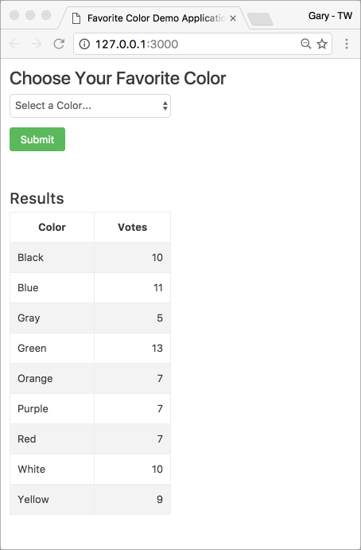

[](https://travis-ci.org/garystafford/fav-color-ngweb)

# Favorite Color Web Application

## Introduction

Favorite Color Web Application is part of a multi-tier Angular-Node-Spring-MongoDB application, designed to demonstrate Packer and Terraform with AWS. The Favorite Color Web Application is a simple Angular 1.5 / Bootstrap 4 SPA, which makes API calls to the [Favorite Color Service](https://github.com/garystafford/fav-color-service) Spring Boot RESTful microservice, via a Node-based [BFF](http://samnewman.io/patterns/architectural/bff/). The Favorite Color Service is backed by MongoDB. The entire application is designed to be provisioned and deployed to AWS, using HashiCorp Packer and Terraform. 

Currently, Node is only used for local development and testing of the application. Node is not required to run the client-side application in Production. You can run the application using Node (`server.js`), or host with Apache (`index.html`).

## Quick Start

The Favorite Color Web Application requires that the [Favorite Color Service](https://github.com/garystafford/fav-color-service) is running, first, locally, on `http://localhost:8091`. It also required MongoDB is running.

Once MongoDB and the Favorite Color Service running separately, to clone, build, test, and run the Favorite Color Web Application, locally:

```bash
git clone https://github.com/garystafford/fav-color-ngweb.git
cd fav-color-ngweb
npm install -g bower gulp-cli
npm install
bower install
npm start
```

The application should start successfully on `http://localhost:3000`, and attempt to open it in your default web browser.

## Results



## Environment Configuration

Informational only, the project uses [gulp-ng-config](https://github.com/ajwhite/gulp-ng-config) `options.environment` [option](https://github.com/ajwhite/gulp-ng-config#optionsenvironment) for specifying environment specific configuration. The master configuration, `configFile.json`, is located in the root of the project.

**Local**<br>
If you modify the master configuration, `configFile.json`, to recreate local development environment configuration file (`local`):

```bash
gulp client.config
```

This will create the `configFile.js` in the `client/dev` directory.

**Production**<br>
If you modify the master configuration, `configFile.json`, to recreate the AWS Production configuration file (`production`):

```bash
gulp client.config:dist
```

This will create the `configFile.js` in the `client/dist` directory.

## Build Production Distribution

To create the `dist` directory for deployment to Production, use one Gulp command: `client.build:dist`. This command aggregates several other commands together.

```bash
gulp client.build:dist
```

## Run with Node in Production

To run the application using Node, instead of Apache, after deploying the `dist` directory, run the following commands, from within the `dist` directory. Environment variable, `PORT` is fully configurable. Note the values in the `configFile.js` will need to be modified for your use. They is specific to my AWS Production environment.

```bash
npm install -g bower gulp-cli
NODE_ENV=production npm install
bower install --production --config.directory=bower_components
PORT=3004 node server.js
```
